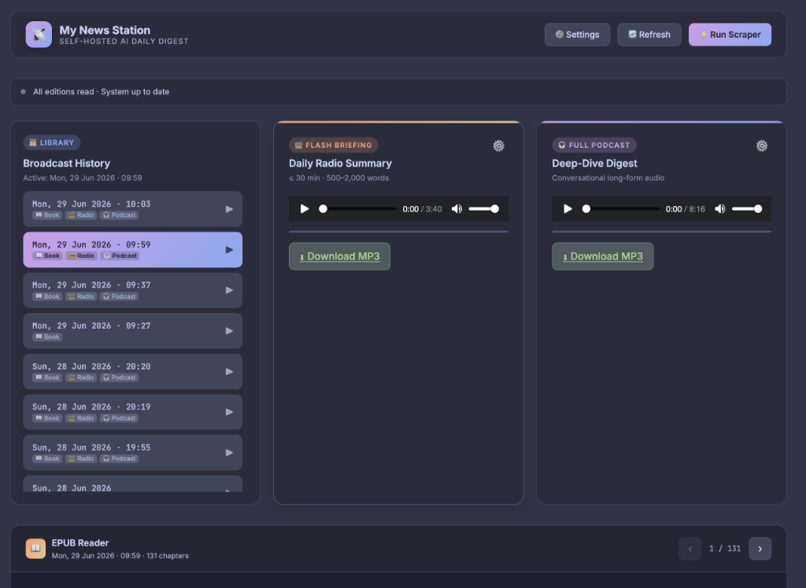
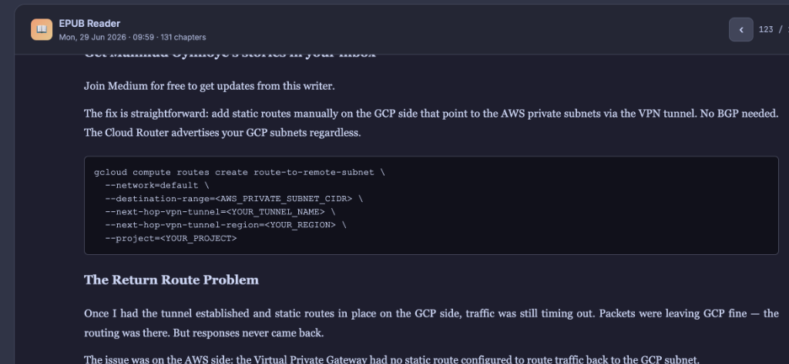

# My News Station

[](https://github.com/knowlesy/my-news-station/actions/workflows/build-image.yml)

**Your own AI news station.** Wake up to a curated EPUB newspaper, a flash radio briefing, a long-form podcast, and a TLDR digest — generated from *your* sources, on *your* hardware, delivered to your browser and your e-reader. No feeds, no algorithms, no tracking. Done when you've read it.



---

## What it does

Every morning, the pipeline reads your sources so you don't have to, and produces:

| Output | What you get |
|--------|--------------|
| 📖 **Daily EPUB newspaper** | Every article, Reader-Mode cleaned, grouped by source — with proper code-block rendering for technical posts |
| ⚡ **TLDR digest** | A second, compact EPUB: one plain-English sentence per article, laid out for small e-ink screens |
| 📻 **Flash radio briefing** | A punchy ~30-minute MP3 of the highlight stories, in a neural voice of your choice |
| 🎧 **Long-form podcast** | A conversational deep-dive MP3 into the day's technical stories |

And the station around them:

- 📚 **OPDS catalog** — e-readers pull editions themselves (CrossPoint/X4, KOReader, Calibre, Moon+ Reader). Toggleable in Settings.
- 🤖 **Pluggable LLMs, per output** — run the briefing on Gemini and the podcast on Claude, or switch any output off entirely. Outputs sharing a backend share a single LLM call to keep token costs down.
- 🔁 **Surgical regeneration** — rebuild just the radio, just the podcast, just the TLDR, or the EPUB itself (no LLM call at all). No paying for everything to fix one thing.
- 🔒 **Paywall detection** — truncated "sign up to read more" articles are detected and skipped (on by default).
- 🧭 **Source health tracking** — see which feeds are active, degraded, or dead; silence the noisy ones.
- 🗞️ **Smart re-runs** — a same-day re-run diffs against *yesterday*, not the last run: nothing missed, nothing re-fetched, tokens saved via a persistent URL registry.
- 🎙️ **Voice picker with live TTS preview** — separate voices for briefing and podcast, previewed in one click.
- 🖥️ **Catppuccin dashboard** — dual EPUB readers, audio players, live scraper console, new-edition badges, four theme flavours.
- 🏷️ **Release automation** — every push tags a release; the dashboard shows exactly which build your server is running.
- 🧹 **Self-cleaning storage** — media older than 10 days is removed automatically so volumes never fill up.



---

## Quick start (Docker Compose)

Five minutes from clone to newspaper:

```bash
# 1. Copy the template configuration
cp .env.example .env

# 2. Open .env and set your LLM key (a free Gemini key works: https://aistudio.google.com)

# 3. Start the services
docker compose up -d --build

# 4. Open the dashboard
open http://localhost:3001

# 5. Generate your first edition (or wait for the daily run)
docker compose run --rm scraper
```

---

## E-reader setup (OPDS)

The station serves a standard OPDS 1.2 catalog at `http://<your-server>/opds`, so any OPDS-capable reader can pull editions itself:

1. Join the e-reader to the same network as the station
2. On the device: **Library → OPDS catalogs → Add catalog**
3. Enter `http://<your-server>/opds` — leave username/password empty
4. Open the catalog: newest editions first, one tap to download

Editions use compact titles (`260704-news-ai`, `260704-newsTLDR-ai`) so the date survives small-screen truncation. The catalog can be switched off in Settings, and the exact URL for your install is shown there too.

---

## Configuration

### LLM backends

Set the default with `LLM_BACKEND` (and override per output in Settings):

| Value        | Description                                | Required credentials        |
|--------------|--------------------------------------------|-----------------------------|
| `gemini`     | Google AI Studio REST                      | `GOOGLE_AI_KEY`             |
| `claude_cli` | Claude via OAuth (no API key needed)       | One-time auth flow (below)  |
| `claude_api` | Anthropic API                              | `ANTHROPIC_API_KEY`         |

**Claude CLI OAuth** (no API key): exec into the running container with `docker exec -it my-news-server claude`, open the printed URL, log in, paste the code back. Credentials persist in a volume.

### Settings modal

Everything else lives in the dashboard's Settings modal and persists server-side (`data/config.json`), so it applies across browsers and survives redeploys:

- **Sources** — RSS feeds, Medium tags (`medium/tags/terraform`), Medium profiles/publications (`@username`), and Substack links (auto-resolved to their feed)
- **Per-briefing source selection** — choose which sources feed the radio vs. the podcast
- **AI & Outputs** — enable/disable each output; pick an LLM backend per output
- **Voices** — per-track neural voice with instant preview
- **Show structure & personality** — the system prompt is yours to edit: make the presenter dry, chatty, or ruthless
- **OPDS catalog** — on/off toggle plus the setup instructions for your install
- **Paywalled posts** — skip truncated articles (default on)
- **Source health** — activity per source, with one-click silencing

---

## Kubernetes deployment

Runs as a Deployment (web server) plus a daily CronJob (scraper), sharing a PVC:

```bash
# 1. Create namespace and apply resources
kubectl apply -f k8s/pvc.yaml
kubectl apply -f k8s/deployment.yaml
kubectl apply -f k8s/service.yaml

# 2. Set credentials
kubectl create secret generic news-secrets \
  --namespace my-news \
  --from-literal=LLM_BACKEND=gemini \
  --from-literal=GOOGLE_AI_KEY="your-google-ai-key"
```

---

## Architecture

```
my-news-station/
├── scraper/
│   ├── scraper.py          # Python pipeline: scrape → curate → LLM → EPUB/TTS
│   └── requirements.txt
├── server/
│   └── src/main.rs         # Rust/Axum: dashboard, media, config API, OPDS
├── frontend/
│   ├── index.html          # Catppuccin SPA dashboard
│   └── js/                 # Readers, playlist, settings, scraper console
├── k8s/                    # Deployment + CronJob + PVC + Service
├── .github/workflows/      # Image build (+ Trivy scan), release tagging
├── Dockerfile              # Multi-stage: Rust builder → Playwright runtime
├── docker-compose.yml      # Local development
└── .env.example
```

**Data flow:** the scraper (Playwright + feedparser) fetches your sources, extracts full articles, deduplicates against a persistent URL registry, merges in anything from earlier runs the same day, and filters paywalled content. TF-IDF clustering picks cross-source highlight stories for the audio tracks. One LLM call per configured backend writes the scripts and the TLDR digest; ebooklib builds the EPUBs and edge-tts renders the audio — all into a shared data volume that the Rust server exposes as the dashboard, `/media`, and the OPDS catalog.

---

## Storage & cleanup

The server deletes generated media older than **10 days** every 6 hours, so persistent volumes never fill up. Configuration, the URL registry, and source-health history are kept.
